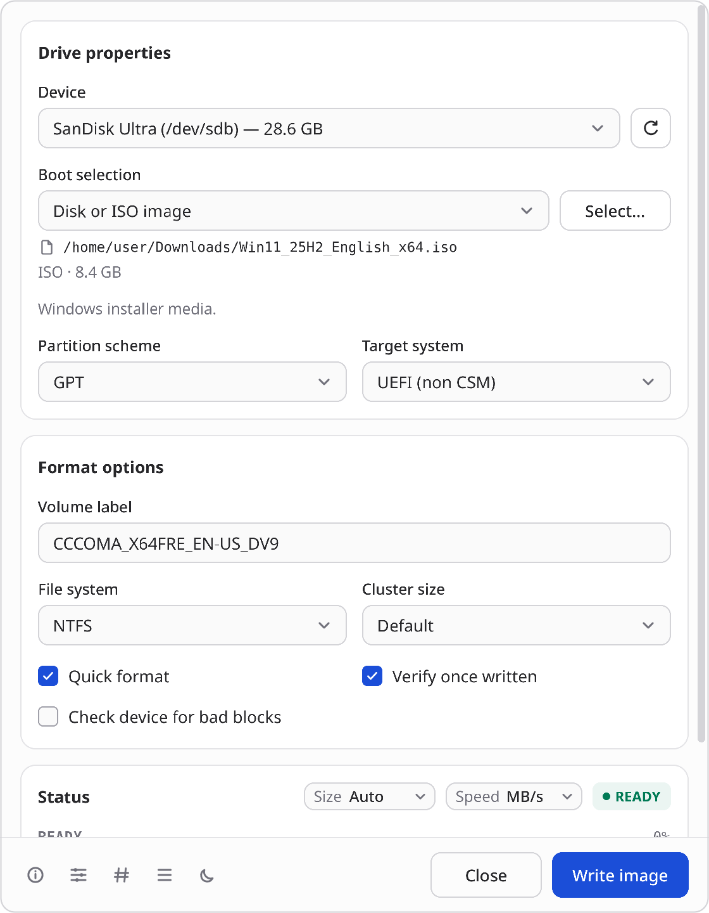
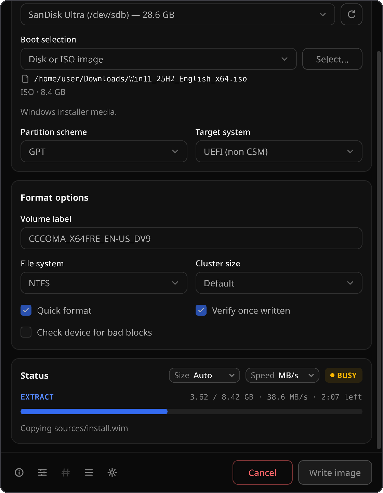

# Rufus Linux

Rufus Linux is an **independent, community-built Linux port inspired by Rufus**. It provides a native desktop workflow for inspecting, formatting, and writing removable media. It is not produced, endorsed, or supported by the upstream Rufus project or its maintainers.

> **Destructive operation warning**
>
> Writing or formatting a device permanently destroys data on that device. The application deliberately hides system disks and most USB hard disks by default, revalidates a device immediately before writing, and requires an explicit confirmation that names the target.

<p align="center">
  
  &nbsp;
  
</p>

## Project status

Rufus Linux is a Linux-native implementation, not a rebuild of the Windows executable. It creates:

- Windows 10/11 installer drives from Windows ISOs. Files over 4 GB are supported through NTFS and the Secure Boot signed UEFI:NTFS loader, with BIOS boot records on MBR.
- Bootable drives from ISOHybrid Linux ISOs, raw and compressed disk images, and VHD/VHDX.
- Formatted drives in FAT, FAT32, exFAT, NTFS, UDF, or ext2/3/4, with optional verification and bad-block checks.

Options that still need an unfinished workflow are recognized and blocked with a direct reason. These include non-hybrid Linux ISOs, FreeDOS, Windows To Go, and persistence. [PARITY.md](docs/PARITY.md) tracks every upstream Rufus feature, and the [capability matrix](docs/CAPABILITIES.md) is the authority for each release.

The goal is output compatibility where Linux has a safe, maintained implementation. It is not to emulate Windows internals with unsafe shortcuts.

## Current product direction

- Native Slint desktop interface on Wayland and X11, with light and dark themes.
- Automatic sysfs-backed device discovery with mount and device-holder safety checks.
- Plug and play: writes go through the system udisks2 service, so nothing extra has to be installed. A small polkit-authorized helper is the fallback.
- MBR/GPT partitioning, raw image writing, verification, and common Linux/portable filesystems.
- ISO/ISOHybrid and compressed-image analysis with clear compatibility and safety feedback.
- Logged, cancellable operations with a final flush before a device is reported ready.

The visual language is intentionally based on the physical act of preparing media: device identity is prominent, destructive state is unmistakable, and advanced controls stay quiet until requested. A progress “write track” is the signature element; it reflects the actual stages—prepare, write, verify, flush—rather than showing decorative motion.

## Build and run

The application is written in Rust with Slint. Slint renders the interface while the platform backend integrates with native Wayland or X11 windows, input, fonts, accessibility, and the desktop theme.

### Debian or Ubuntu

```sh
sudo apt install build-essential cargo rustc pkg-config libfontconfig1-dev libfreetype-dev \
  libxkbcommon-dev libwayland-dev libx11-dev libxcb1-dev polkitd pkexec
cargo build
cargo run
```

### Fedora

```sh
sudo dnf install cargo rust fontconfig-devel freetype-devel libxkbcommon-devel \
  wayland-devel libX11-devel libxcb-devel polkit pkgconf-pkg-config
cargo build
cargo run
```

### Arch Linux

```sh
sudo pacman -S --needed base-devel rust fontconfig freetype2 libxkbcommon wayland \
  libx11 libxcb polkit
cargo build
cargo run
```

For the full formatter and image-tool set, install the runtime dependencies listed in [Building and packaging](docs/BUILDING.md). During development, raw writes should be tested against disposable image files or loop devices, never a disk containing useful data.

## Install a release

Download the package for your x86_64 distribution from
[GitHub Releases](https://github.com/NitroDiesel/rufus-linux/releases).
Keep `SHA256SUMS` beside the downloaded package and verify it before installing:

```sh
sha256sum -c SHA256SUMS
```

Install the matching native package:

```sh
# Debian or Ubuntu
sudo apt install ./rufus-linux_*_amd64.deb

# Fedora
sudo dnf install ./rufus-linux-*.x86_64.rpm

# Arch Linux
sudo pacman -U ./rufus-linux-*-x86_64.pkg.tar.zst
```

Or run the portable desktop build on an x86_64 glibc 2.28+ system:

```sh
chmod +x ./rufus-linux-*-x86_64.AppImage
./rufus-linux-*-x86_64.AppImage
```

If FUSE is unavailable, launch it with `--appimage-extract-and-run`. The
AppImage writes and formats through the udisks2 service that desktop
distributions already run, so it needs no installation and contains no
privileged code. When udisks2 is absent, a native package's helper is used
instead.

The native packages install the desktop application, privileged helper,
polkit policy, desktop metadata, and required runtime dependencies. Each
release is stable within its documented capability set; review the
[capability matrix](docs/CAPABILITIES.md) before writing to removable media.

`SHA256SUMS` detects download corruption. GitHub build provenance attached to
the release provides a separate publisher-verification path.

## Install layout

Distribution packages should use these paths:

| Artifact | Destination |
|---|---|
| Desktop application | `/usr/bin/rufus-linux` |
| Privileged helper | `/usr/libexec/rufus-linux-helper` |
| Desktop entry | `/usr/share/applications/io.github.nitrodiesel.rufus-linux.desktop` |
| AppStream metadata | `/usr/share/metainfo/io.github.nitrodiesel.rufus-linux.metainfo.xml` |
| Polkit policy | `/usr/share/polkit-1/actions/io.github.nitrodiesel.rufus-linux.policy` |
| Runtime directory rule | `/usr/lib/tmpfiles.d/rufus-linux.conf` |

The helper path is a packaging contract. Until the helper is present, packages must not install the polkit policy or imply that destructive operations are available.

## Feature notes

- **ReFS:** Linux has no safe, production-quality ReFS formatter. ReFS creation is unavailable; existing ReFS media may be identified read-only.
- **MS-DOS:** Microsoft DOS system files are proprietary and are not distributed. A future workflow may accept user-supplied, lawfully obtained files.
- **FFU:** Windows FFU capture/apply relies on Windows servicing components. It is not promised until a maintained, independently verifiable Linux implementation exists.
- **Windows To Go:** Creation is recognized but blocked. A safe implementation
  requires WIM application, BCD generation, offline registry work, and boot
  fixtures; merely installing `wimlib` does not enable it.
- **Microsoft downloads:** Windows images, setup files, bootloaders, and tools are never bundled. Any download integration must use Microsoft-hosted sources and verify signed metadata.

## Documentation

- [Capabilities and parity](docs/CAPABILITIES.md)
- [Safety and privilege model](docs/SAFETY.md)
- [Architecture](docs/ARCHITECTURE.md)
- [Building and packaging](docs/BUILDING.md)

## License and attribution

Rufus Linux is licensed under the GNU General Public License version 3. See [LICENSE.txt](LICENSE.txt). The upstream Rufus source is also GPLv3; derivative portions must retain their copyright notices and corresponding source. See [THIRD_PARTY.md](THIRD_PARTY.md) for dependency and asset obligations.

“Rufus” is used descriptively to identify the project this independent port is based on. Its name and branding are not a claim of upstream affiliation.
